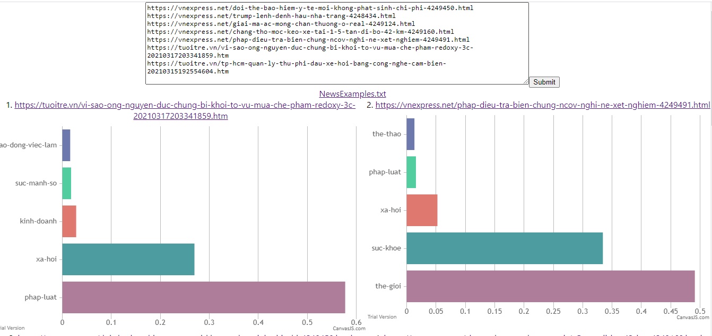
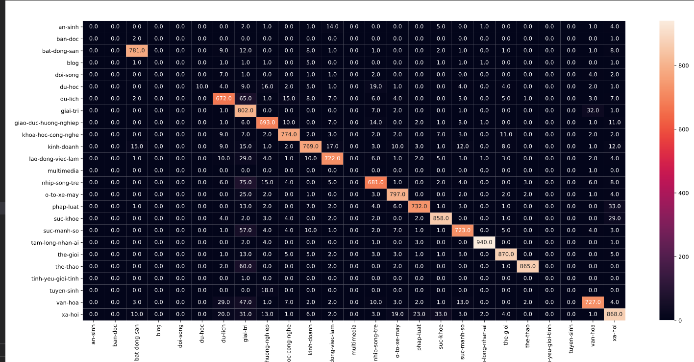
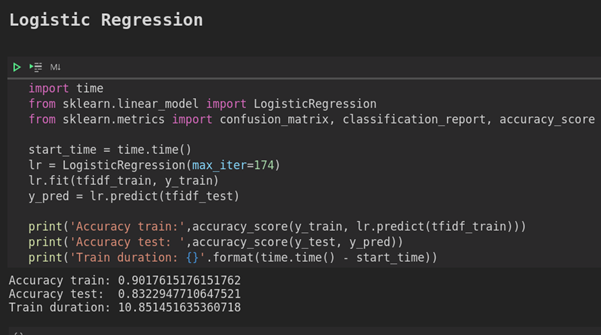

# 

Build a webapp that predict the topic of news with Logistic Regression algorithm.

## Main Webapp

## Confusion matrix

## Accuracy

- Accuracy train: 0.901..
- Accuracy test: 0.832.
- Train duration: 10.851

## Technique
###  WebApp
- Backend: Django
- Frontend: ReactJS
###  Build Model
- PyVi
- CountVectorizer
- Sklearn
1. ...

## Contributor:
1. Le Van Can
2. Nguyen Van Dai